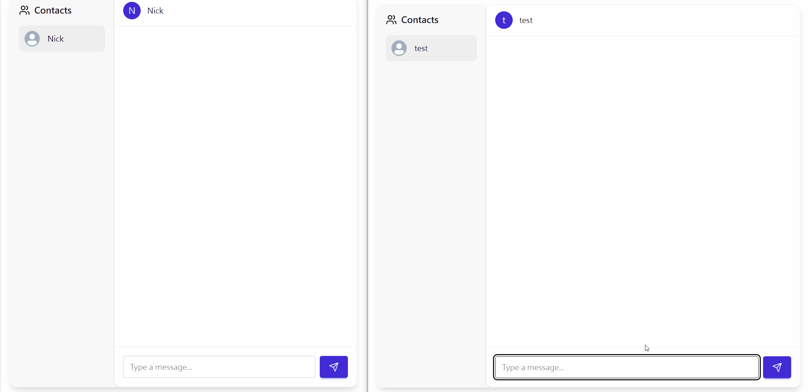
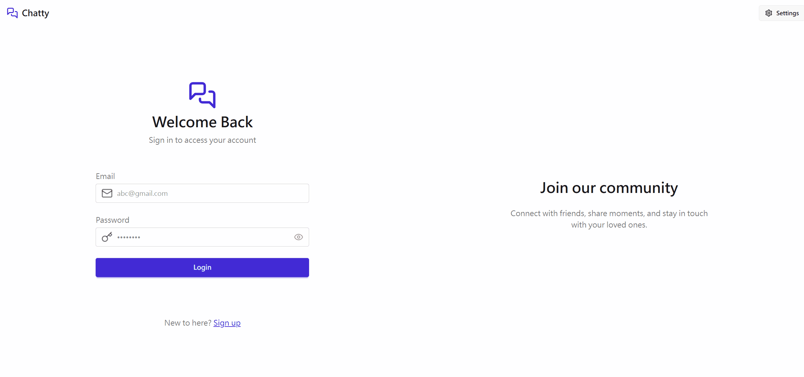
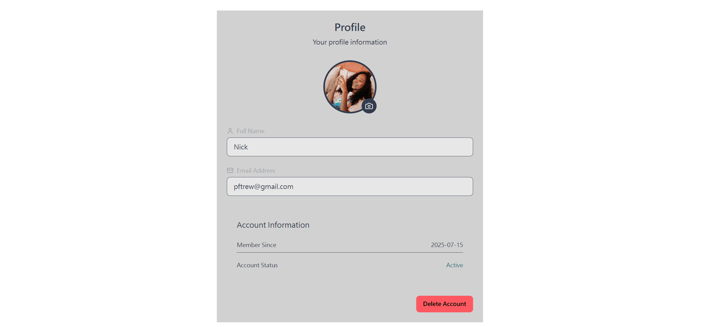
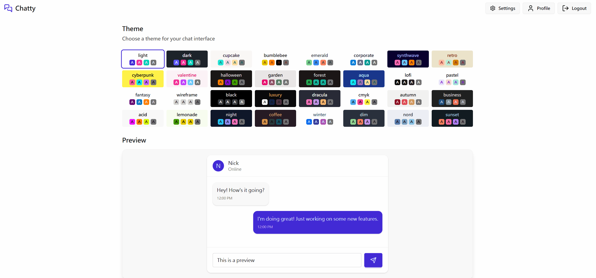

Chatty is a full-stack real-time chat application designed for seamless, secure, and instant communication. With a sleek, responsive interface and a robust backend, users can sign up, log in, and exchange messages effortlessly. Powered by Socket.IO for real-time messaging and built with modern technologies, Chatty delivers a fast and engaging user experience.

🚀 Tech Stack

Frontend: React, Tailwind CSS

Backend: Node.js, Express

Database: MongoDB

Real-Time Communication: Socket.IO

Authentication: JSON Web Tokens (JWT)

Deployment: Vercel, Render

🔗 Live Demo: https://chatty-ten-rho.vercel.app/

### 💬 Real-Time Messaging

### 🔐 Simple & Secure Login

### 🖼️ Customizable Profile Avatars

### 🎨 Multiple Theme Selection

